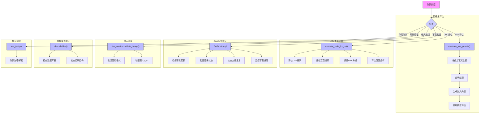

### 5.1 测试方法

#### 模块说明

1. **工具输出评估**：
   - 使用`evaluate_tool_results`函数评估工具输出
   - 处理上下文数据并生成嵌入向量
   - 调用大语言模型进行最终评估

2. **URL工具评估**：
   - 使用`evaluate_tools_for_url`评估不同工具对URL的价值
   - 分别评估CSE搜索、豆包搜索、URL分析和页面分析

3. **Java服务验证**：
   - 在下载过程中进行多项验证
   - 包括配额检查、登录验证、文件去重和进度监控

4. **输入验证**：
   - 验证图片格式和大小
   - 确保输入数据符合要求

5. **前提条件验证**：
   - 检查数据库表和目录结构
   - 确保系统运行环境正常

6. **单元测试**：
   - 对关键功能进行单元测试
   - 如加密解密功能的测试
