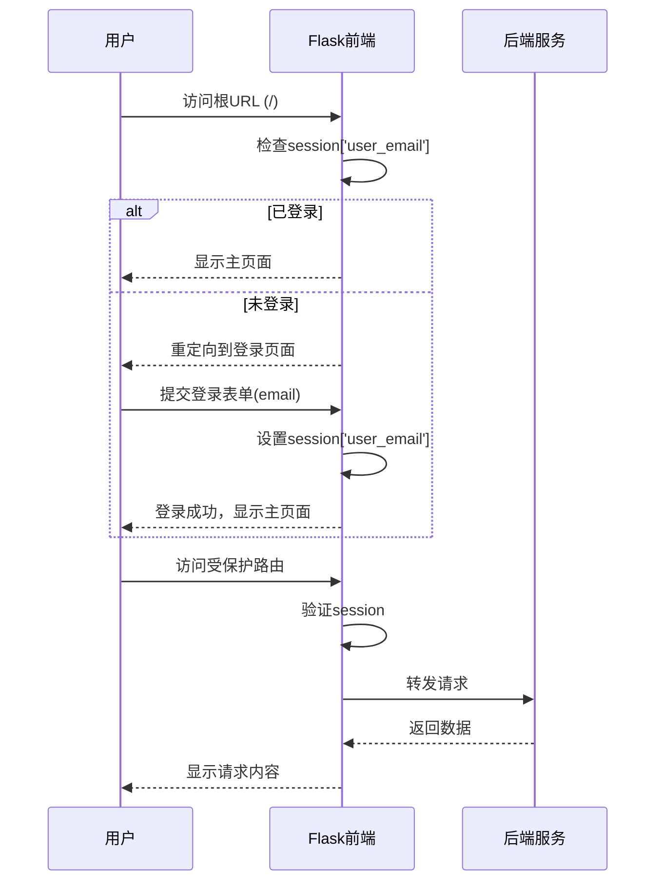

# 5.3 系统运行实例 - 系统启动及登录流程

## 系统启动流程

1. **Java Spring Boot 应用程序启动**
   - 主类 `LibrarySearchApplication.java` 启动，标注 `@SpringBootApplication` 和 `@EnableScheduling`
   - 默认运行在端口8080
   - 提供核心后端服务：
     - 搜索服务 (`SearchServiceImpl`)
     - 书籍下载服务 (`GetDLinkImpl`)
     - 数据库交互（搜索历史、搜索次数统计）

2. **Flask 库服务应用程序启动**
   - Python Flask 应用，运行在端口5000
   - 配置：
     - 会话密钥
     - 自定义下载目录 (`C:\Users\PC\eclipse-workspace\LibrarySearch\src\main\resources\static\books`)
     - 连接 `library` 数据库
   - 功能：
     - 主网页服务
     - 文件列表/下载/搜索请求处理
     - 豆聊服务API转发

3. **Flask Doubao Chat API 应用启动**
   - 独立Flask应用 (`doubao_combined_service.py`)
   - 运行在端口10806
   - 功能：
     - 初始化Doubao客户端
     - 处理用户消息
     - 工具调用 (`get_dlink`, `context_retrieval`等)
     - 大模型交互

## 前端登录流程

### 详细登录步骤

1. **初始访问**
   - 用户访问Flask应用的根URL (http://localhost:5000/)

2. **登录检查**
   - `@login_required`装饰器检查`session['user_email']`
   - 未登录则重定向到登录页面

3. **登录表单提交**
   - 用户输入email并提交表单
   - 表单提交到`/set_session`或`/set_user_session`端点

4. **会话设置**
   - 处理程序从表单获取email (`request.form.get('email')`)
   - 设置`session['user_email']`
   - 返回成功响应

5. **访问受保护页面**
   - 成功登录后可访问：
     - 文件列表页面 (`/filemainpage`)
     - 下载历史 (`/download_history`)
     - 搜索结果 (`/search`)
     - 工单提交 (`/submit_ticket`)
     - 推荐页面 (`/recommend`)
