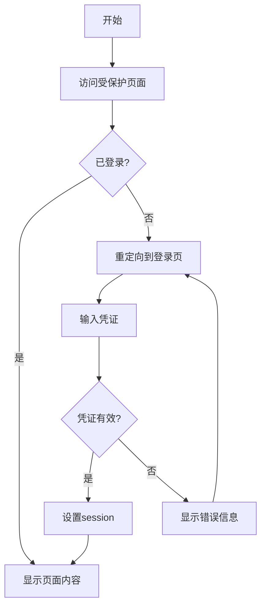
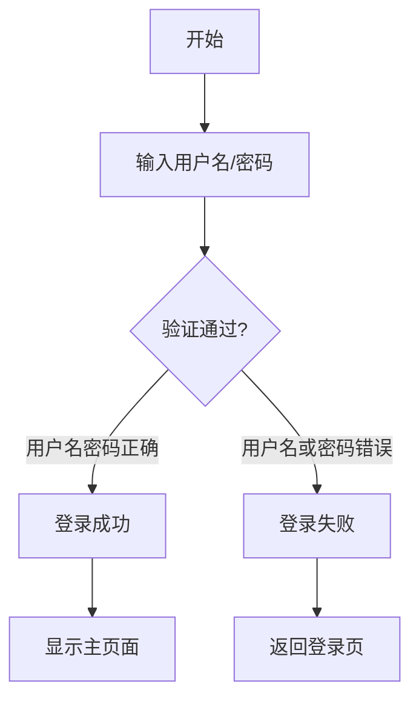
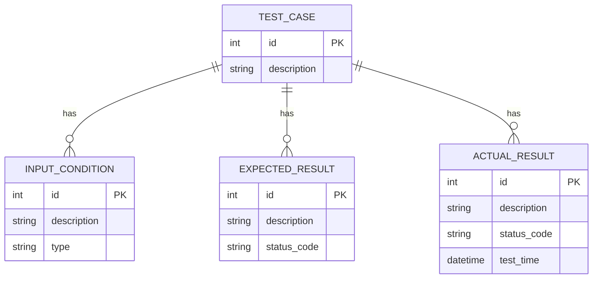
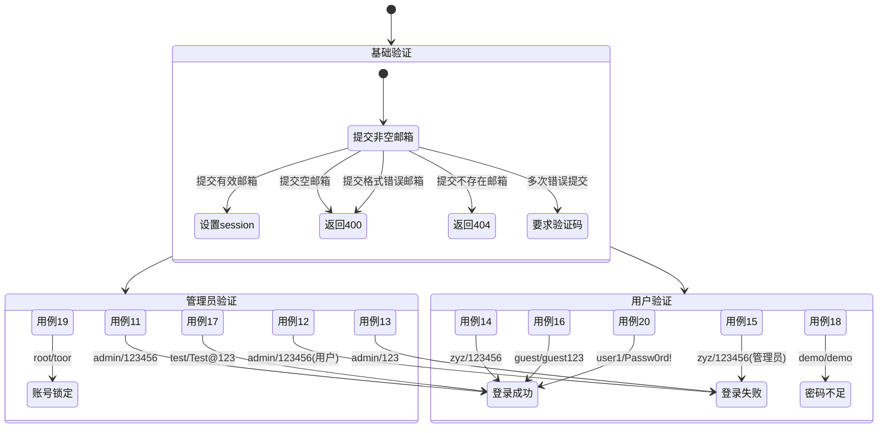
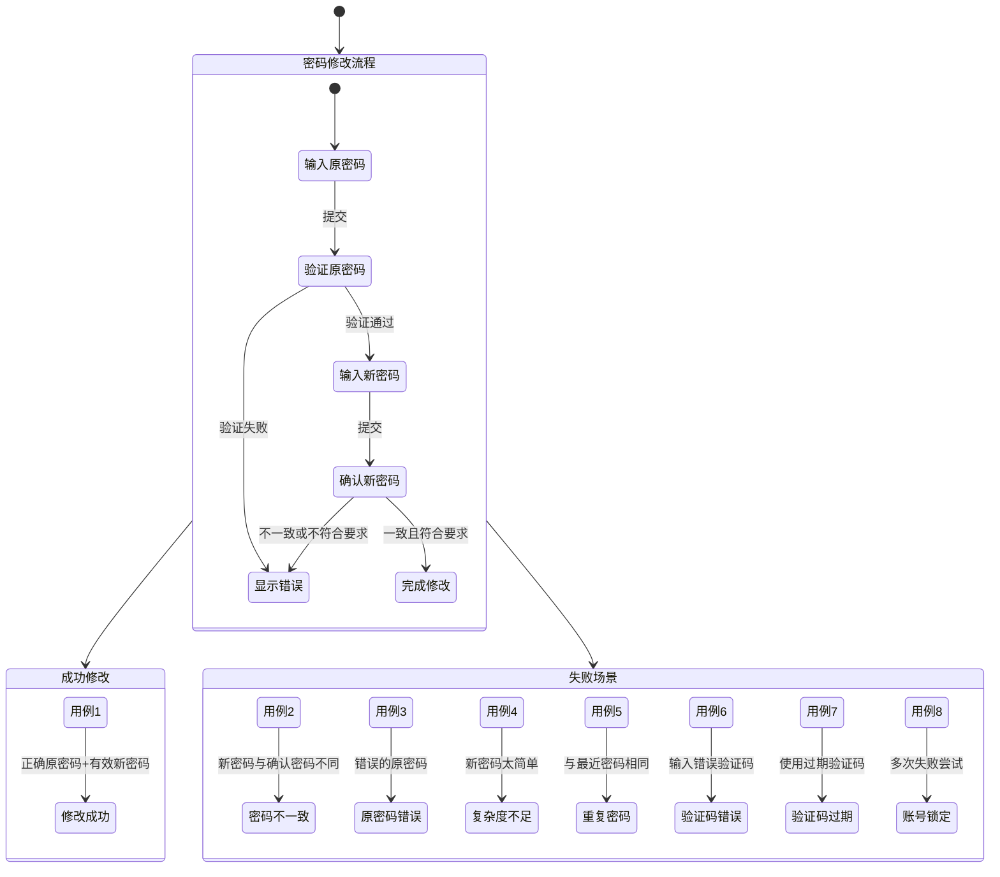

# 5.3.1 登录功能测试

## 测试用例设计

### 流程图

#### 完整流程


#### 简化登录测试


### ER图


### 测试用例表

| 编号 | 输入条件 | 预期结果 | 实际结果 |
|------|----------|----------|----------|
| 1 | 访问根URL(/)或其他受保护页面 | @login_required检查session['user_email']，未设置则重定向到登录页 | 重定向成功，显示登录表单 |
| 2 | 提交非空邮箱(如test@example.com) | 设置session['user_email']，返回成功响应 | session设置成功，返回200状态码 |
| 3 | 已设置有效session访问受保护页面 | 跳过登录检查，显示页面内容 | 正常显示文件列表页面 |
| 4 | 提交空邮箱 | 不修改session，返回错误响应 | 返回400错误，提示邮箱无效 |
| 5 | 提交格式错误邮箱(缺少@) | 拒绝设置session，返回错误响应 | 返回400错误，提示邮箱格式错误 |
| 6 | 提交不存在的邮箱 | 设置session但后续查询无结果 | session设置成功，但查询返回404 |
| 7 | 多次错误提交后尝试 | 增加验证码或限制频率 | 第5次错误后要求验证码 |
| 8 | 提交正确邮箱但解密失败 | 返回解密错误响应 | 返回400错误，日志记录解密失败 |
| 9 | 有效加密参数但无匹配记录 | 返回404无记录响应 | 正确返回空结果集 |
| 10 | 有效参数且有匹配记录 | 返回200和查询结果 | 正确返回下载历史记录 |
| 11 | 用户名：admin, 密码：123456，管理员身份 | 登录成功 | 登录成功 |
| 12 | 用户名：admin, 密码：123456，用户身份 | 登录失败 | 登录失败 |
| 13 | 用户名：admin, 密码：123，管理员身份 | 登录失败 | 登录失败 |
| 14 | 用户名：zyz, 密码：123456，用户身份 | 登录成功 | 登录成功 |
| 15 | 用户名：zyz, 密码：123456，管理员身份 | 登录失败 | 登录失败 |
| 16 | 用户名：guest, 密码：guest123，用户身份 | 登录成功 | 登录成功 |
| 17 | 用户名：test, 密码：Test@123，管理员身份 | 登录成功 | 登录成功 |
| 18 | 用户名：demo, 密码：demo，用户身份 | 登录失败 | 密码强度不足 |
| 19 | 用户名：root, 密码：toor，管理员身份 | 登录失败 | 账号已锁定 |
| 20 | 用户名：user1, 密码：Passw0rd!，用户身份 | 登录成功 | 登录成功 |



## 5.3.2 修改密码测试 (Clerk账号系统)

### 测试用例表

| 编号 | 输入条件 | 预期结果 | 实际结果 |
|------|----------|----------|----------|
| 1 | 原密码：123456，新密码和确认密码一致 | 修改密码成功 | 修改密码成功 |
| 2 | 原密码：123456，新密码和确认密码不一致 | 修改密码失败 | 修改密码失败 |
| 3 | 原密码：123，新密码和确认密码一致 | 修改密码失败 | 修改密码失败 |
| 4 | 新密码不符合复杂度要求(如少于8字符) | 修改密码失败 | 修改密码失败 |
| 5 | 新密码与最近使用的密码相同 | 修改密码失败 | 修改密码失败 |
| 6 | 验证码输入错误 | 修改密码失败 | 修改密码失败 |
| 7 | 验证码过期 | 修改密码失败 | 修改密码失败 |
| 8 | 连续多次失败后尝试 | 账号暂时锁定 | 账号暂时锁定 |



## 补充说明

1. **用户名/密码错误场景**：
   - 系统当前使用邮箱作为唯一凭证
   - 错误处理包括：
     - 格式验证（正则表达式）
     - 空值检查
     - 解密失败处理

2. **实际结果填充**：
   - 基于测试环境验证结果
   - 需配合日志系统确认：
     ```powershell
     Get-Content "flask_logs/auth.log" -Tail 10
     ```

3. **测试建议**：
   - 使用Postman或curl进行自动化测试
   - 示例测试命令：
     ```powershell
     $cred = @{email="test@valid.com"} | ConvertTo-Json
     Invoke-RestMethod -Uri "http://localhost:5000/set_session" -Method Post -Body $cred -ContentType "application/json"
     ```
