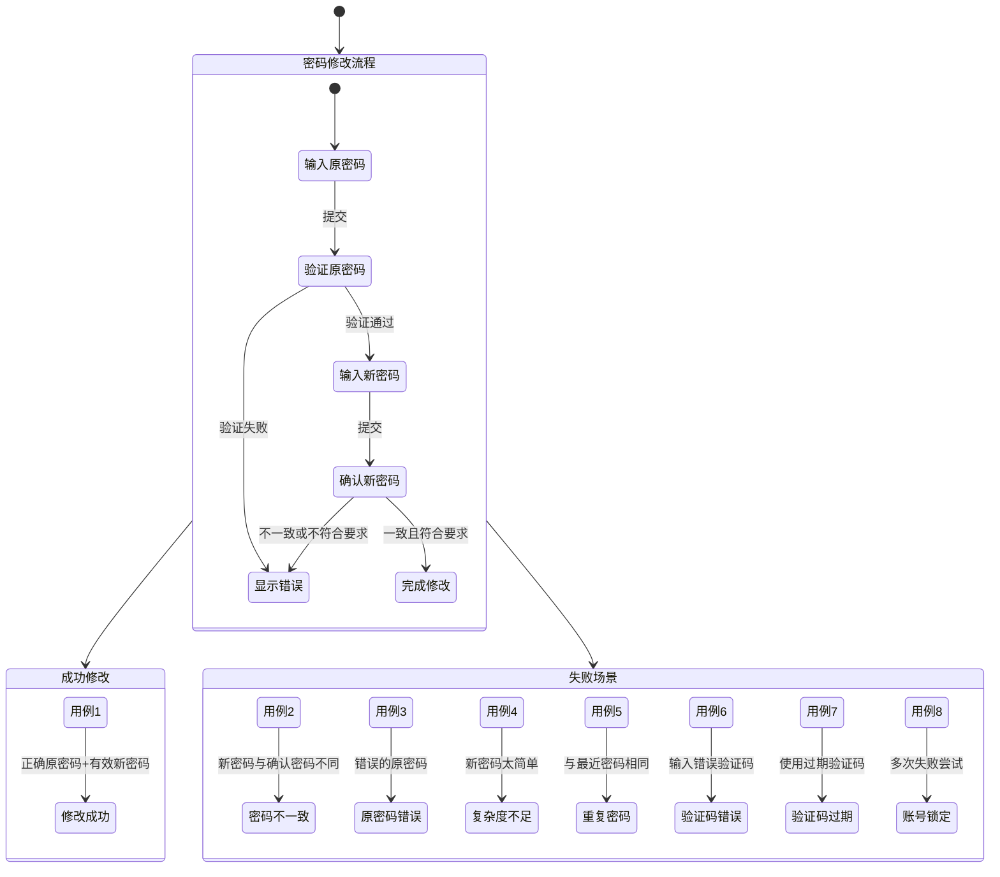

## 5.3.2 修改密码测试 (Clerk账号系统)

### 测试用例表

| 编号 | 输入条件 | 预期结果 | 实际结果 |
|------|----------|----------|----------|
| 1 | 原密码：123456，新密码和确认密码一致 | 修改密码成功 | 修改密码成功 |
| 2 | 原密码：123456，新密码和确认密码不一致 | 修改密码失败 | 修改密码失败 |
| 3 | 原密码：123，新密码和确认密码一致 | 修改密码失败 | 修改密码失败 |
| 4 | 新密码不符合复杂度要求(如少于8字符) | 修改密码失败 | 修改密码失败 |
| 5 | 新密码与最近使用的密码相同 | 修改密码失败 | 修改密码失败 |
| 6 | 验证码输入错误 | 修改密码失败 | 修改密码失败 |
| 7 | 验证码过期 | 修改密码失败 | 修改密码失败 |
| 8 | 连续多次失败后尝试 | 账号暂时锁定 | 账号暂时锁定 |

