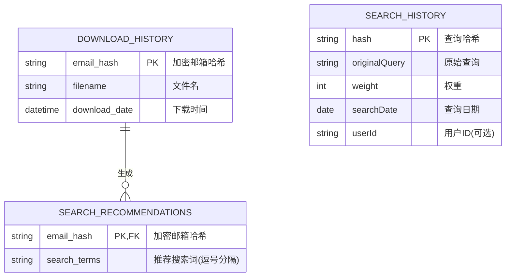

### 数据库结构说明

1. **DOWNLOAD_HISTORY(下载历史表)**
   - **用途**: 记录用户下载的书籍
   - **主键**: email_hash (加密后的邮箱哈希值)
   - **字段**:
     - filename: 下载的文件名
     - download_date: 下载时间戳
   - **操作**: 下载时插入记录，按邮箱哈希查询

2. **SEARCH_RECOMMENDATIONS(搜索推荐表)**
   - **用途**: 存储基于下载历史生成的搜索关键词推荐
   - **外键**: email_hash (关联下载历史)
   - **字段**:
     - search_terms: 逗号分隔的推荐搜索词
   - **操作**: AI分析生成推荐后插入

3. **SEARCH_HISTORY(搜索历史表)**
   - **用途**: 记录用户搜索查询及频率
   - **主键**: hash (查询内容的哈希值)
   - **字段**:
     - originalQuery: 原始查询字符串
     - weight: 查询频率/权重
     - searchDate: 查询日期
     - userId: 关联用户的可选字段
   - **操作**: 查询时更新计数，可获取热门搜索

### 关系说明
- 下载历史表与搜索推荐表是一对多关系
- 系统通过加密邮箱哈希关联用户数据
- 搜索历史通过哈希值唯一标识查询
- 未明确定义独立的用户表
