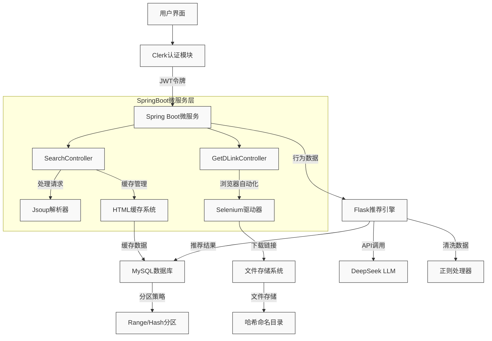

# LibrarySearch 项目

📚 基于Flask与Spring Boot的多功能电子书库搜索系统，集成个性化推荐与下载管理

## 项目概述

本项目实现了一个多模块的电子书库搜索系统，主要功能包括智能搜索、安全下载、用户行为分析和个性化推荐。系统采用前后端分离架构，结合Python与Java技术栈，通过MySQL实现数据持久化，并集成第三方API增强功能。




## 主要功能

### 🔍 智能搜索系统
- 多关键词组合检索
- 搜索结果缓存优化
- 热门搜索词统计
- 跨站资源聚合

### 🔒 用户认证体系
- Clerk身份验证集成
- 会话管理
- 权限控制
- 安全下载校验

### 📥 下载管理系统
- 文件分页浏览
- 下载历史追踪
- 音频书请求工单
- 下载链接动态生成

### 🧠 智能推荐系统
- 基于下载历史的个性化推荐
- DeepSeek API搜索词建议
- 用户行为权重分析
- JSON格式推荐存储

### 📊 数据管理
- 搜索/下载行为日志
- MySQL分区表优化
- 自动化数据清理
- 系统配置集中管理

## 技术栈

### 后端框架
- **Flask** (Python): 主Web服务、文件管理、用户会话
- **Spring Boot** (Java): 搜索微服务、推荐引擎、数据库交互
- **MyBatis**: ORM框架
- **Selenium**: 网页内容抓取

### 数据库
- **MySQL 8.0**: 主数据存储
- 分区策略：
  - 范围分区（按日期）
  - 哈希分区（用户ID）
  - 键值分区（邮箱哈希）

### 前端技术
- Jinja2模板引擎
- HTML/CSS/JavaScript
- Clerk身份组件

### 第三方服务
- DeepSeek LLM API
- ChromeDriver
- Jsoup HTML解析

## 数据库设计

### 核心表结构

| 表名                     | 描述                   | 分区策略         |
|--------------------------|------------------------|------------------|
| `notebook_audio_requests` | 音频请求工单           | RANGE (日期)    |
| `download_history`       | 下载历史记录           | HASH (ID)       |
| `search_history`         | 搜索历史记录           | RANGE (年份)    |
| `search_recommendations` | 个性化推荐数据         | LINEAR KEY      |
| `system_config`          | 系统配置表             | -               |

```sql
-- 示例建表语句
CREATE TABLE `download_history` (
  `id` INT AUTO_INCREMENT,
  `user_email` VARCHAR(255),
  `filename` VARCHAR(512),
  `download_date` DATETIME,
  PRIMARY KEY (`id`)
) PARTITION BY HASH(id) PARTITIONS 4;
安装指南
环境要求
Python 3.9+

Java 17+

MySQL 8.0+

ChromeDriver 120+

配置步骤
克隆仓库

bash
复制
git clone https://github.com/schxar/LibrarySearch.git
cd LibrarySearch
Python依赖安装

bash
复制
pip install -r requirements.txt
环境变量配置
创建 .env 文件：

ini
复制
DEEPSEEK_API_KEY=your_api_key
DB_HOST=localhost
DB_USER=root
DB_PASSWORD=secret
数据库初始化

bash
复制
mysql -u root -p < database/schema.sql
服务启动

bash
复制
# 启动Flask服务 (端口10805)
python app.py

# 启动Spring Boot服务 (端口8080)
cd search-service
mvn spring-boot:run
API文档
Flask端点
端点	方法	描述
/api/download/<hash>	GET	文件下载
/api/search	POST	书籍搜索
/api/recommendations	GET	获取个性化推荐
/api/tickets	POST	提交音频请求工单
Spring Boot端点
java
复制
@GetMapping("/search")
public ResponseEntity<String> searchBooks(
    @RequestParam String keyword,
    @RequestParam(defaultValue = "1") int page) {
    // 搜索实现
}
使用示例
搜索请求
http
复制
GET http://localhost:8080/search?keyword=python编程&page=2
推荐响应
json
复制
{
  "recommendations": [
    {"title": "机器学习实战", "score": 0.92},
    {"title": "Python数据分析", "score": 0.87}
  ]
}


许可协议
本项目采用 MIT License。
