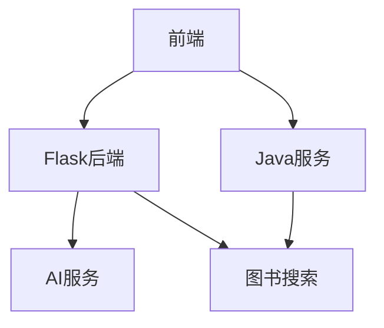
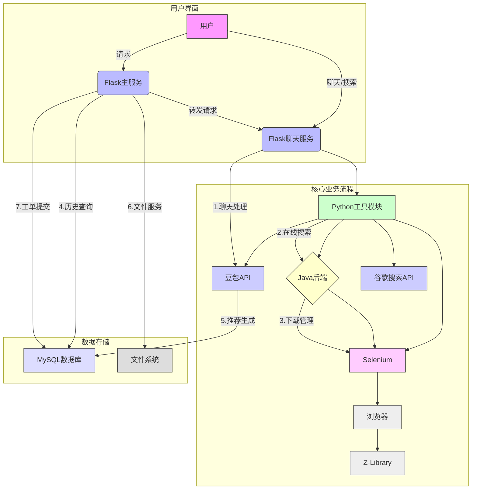
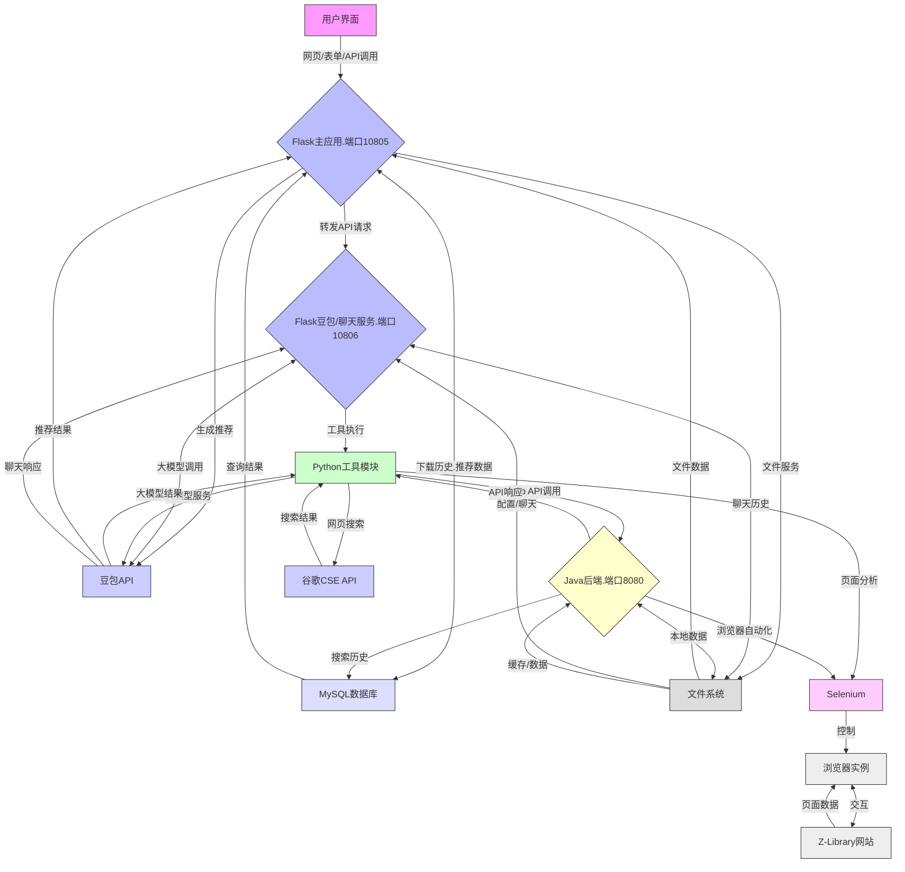

# LibrarySearch 项目文档

## 项目概述
集成AI聊天、图书搜索和多媒体处理的综合服务平台，包含：
- Flask Python后端服务
- Java Spring Boot图书搜索服务
- 前端交互界面

## 核心功能
1. **AI聊天服务**：支持文本/图片输入，工具自动调用
2. **图书搜索**：集成Z-Library搜索和下载
3. **多媒体处理**：图片内容分析和音频处理

## 技术架构








## 详细文档
- [Flask后端文档](flask_openai_backend/FLASK_BACKEND_DOC.md)
- [Java服务文档](src/main/java/com/example/librarysearch/JAVA_DOC.md)

## 快速开始
```bash
# 启动Flask服务
python flask_openai_backend/doubao_combined_service.py

# 启动Java服务
./mvnw spring-boot:run
