# LibrarySearch 项目

📚 基于Flask与Spring Boot的多功能电子书库搜索系统，集成个性化推荐与下载管理

## 项目概述

本项目实现了一个多模块的电子书库搜索系统，主要功能包括智能搜索、安全下载、用户行为分析和个性化推荐。系统采用前后端分离架构，结合Python与Java技术栈，通过MySQL实现数据持久化，并集成第三方API增强功能。

```mermaid
%%{init: {'themeVariables': { 
    'textColor': '#333',
    'primaryColor': '#d9e8f5',
    'lineColor': '#666',
    'fontFamily': 'Microsoft YaHei'
}}}%%
graph TD
    A[用户界面] --> B[Clerk认证模块]
    B -->|JWT令牌| C[Spring Boot微服务]
    
    subgraph SpringBoot微服务层
        C --> D[搜索控制器]
        C --> E[下载链接控制器]
        D -->|处理请求| F[Jsoup解析器]
        D -->|缓存管理| G[HTML缓存系统]
        E -->|浏览器自动化| H[Selenium驱动器]
    end
    
    G -->|缓存数据| I[MySQL数据库]
    H -->|下载链接| J[文件存储系统]
    
    C -->|行为数据| K[Flask推荐引擎]
    K -->|API调用| L[DeepSeek LLM]
    K -->|推荐结果| I
    K -->|清洗数据| M[正则处理器]
    
    I -->|分区策略| N[范围/哈希分区]
    J -->|文件存储| O[哈希命名目录]

    classDef box fill:#e8f5e9,stroke:#2e7d32,stroke-width:1.5px,color:#1b5e20;
    class A,B,C,D,E,F,G,H,I,J,K,L,M,N,O box;

```





```mermaid
%%{init: {'theme':'base', 'themeVariables': {
    'primaryColor': '#fff3e0',
    'textColor': '#37474f',
    'fontFamily': 'Microsoft YaHei'
}}}%%
graph LR
    A[用户] --> B(开始);
    B --> C{用户操作类型?};
    C -- 搜索 --> D[搜索输入];
    D --> E{缓存有效?};
    E -- 是 --> F[从缓存加载];
    E -- 否 --> G[从Z-Library获取];
    G --> H[保存HTML到缓存];
    H --> I[解析HTML];
    F --> I;
    I --> J{显示结果};
    J --> K[用户选择书籍];
    K --> L{音频存在?};
     L -- 是 --> M[播放音频];
     L -- 否 --> N{提交工单};
     N --> O[创建音频请求];
     O --> P(结束);
    C -- 下载 --> Q[选择文件];
    Q --> R[下载文件];
     R --> P;
    C -- 请求推荐 --> S[用户邮箱输入];
    S --> T[获取下载历史];
    T --> U[通过DeepSeek生成搜索词];
    U --> V[显示推荐结果];
     V --> P;

    classDef process fill:#e3f2fd,stroke:#1565c0,color:#0d47a1;
    classDef decision fill:#fff8e1,stroke:#f9a825,color:#ef6c00;
    classDef endpoint fill:#f8bbd0,stroke:#c2185b,color:#880e4f;
    
    class A,B,D,E,F,G,H,I,J,K,Q,R,S,T,U,V process;
    class C,L,N decision;
    class P,O endpoint;

```

## 主要功能

### 🔍 智能搜索系统
- 多关键词组合检索
- 搜索结果缓存优化
- 热门搜索词统计
- 跨站资源聚合

### 🔒 用户认证体系
- Clerk身份验证集成
- 会话管理
- 权限控制
- 安全下载校验

### 📥 下载管理系统
- 文件分页浏览
- 下载历史追踪
- 音频书请求工单
- 下载链接动态生成

### 🧠 智能推荐系统
- 基于下载历史的个性化推荐
- DeepSeek API搜索词建议
- 用户行为权重分析
- JSON格式推荐存储

### 📊 数据管理
- 搜索/下载行为日志
- MySQL分区表优化
- 自动化数据清理
- 系统配置集中管理

## 技术栈

### 后端框架
- **Flask** (Python): 主Web服务、文件管理、用户会话
- **Spring Boot** (Java): 搜索微服务、推荐引擎、数据库交互
- **MyBatis**: ORM框架
- **Selenium**: 网页内容抓取

### 数据库
- **MySQL 8.0**: 主数据存储
- 分区策略：
  - 范围分区（按日期）
  - 哈希分区（用户ID）
  - 键值分区（邮箱哈希）

### 前端技术
- Jinja2模板引擎
- HTML/CSS/JavaScript
- Clerk身份组件

### 第三方服务
- DeepSeek LLM API
- ChromeDriver
- Jsoup HTML解析

## 数据库设计

### 核心表结构

| 表名                     | 描述                   | 分区策略         |
|--------------------------|------------------------|------------------|
| `notebook_audio_requests` | 音频请求工单           | RANGE (日期)    |
| `download_history`       | 下载历史记录           | HASH (ID)       |
| `search_history`         | 搜索历史记录           | RANGE (年份)    |
| `search_recommendations` | 个性化推荐数据         | LINEAR KEY      |
| `system_config`          | 系统配置表             | -               |

```sql
-- 示例建表语句
CREATE TABLE `download_history` (
  `id` INT AUTO_INCREMENT,
  `user_email` VARCHAR(255),
  `filename` VARCHAR(512),
  `download_date` DATETIME,
  PRIMARY KEY (`id`)
) PARTITION BY HASH(id) PARTITIONS 4;
```
安装指南
环境要求
Python 3.9+

Java 17+

MySQL 8.0+

ChromeDriver 120+

配置步骤
克隆仓库

bash
复制
git clone https://github.com/schxar/LibrarySearch.git
cd LibrarySearch
Python依赖安装

bash
复制
pip install -r requirements.txt
环境变量配置
创建 .env 文件：

ini
复制
DEEPSEEK_API_KEY=your_api_key
DB_HOST=localhost
DB_USER=root
DB_PASSWORD=secret
数据库初始化

bash
复制
mysql -u root -p < database/schema.sql
服务启动

bash
复制
# 启动Flask服务 (端口10805)
python app.py

# 启动Spring Boot服务 (端口8080)
cd search-service
mvn spring-boot:run
API文档
Flask端点
端点	方法	描述
/api/download/<hash>	GET	文件下载
/api/search	POST	书籍搜索
/api/recommendations	GET	获取个性化推荐
/api/tickets	POST	提交音频请求工单
Spring Boot端点
java
复制
@GetMapping("/search")
public ResponseEntity<String> searchBooks(
    @RequestParam String keyword,
    @RequestParam(defaultValue = "1") int page) {
    // 搜索实现
}
使用示例
搜索请求
http
复制
GET http://localhost:8080/search?keyword=python编程&page=2
推荐响应
json
复制
{
  "recommendations": [
    {"title": "机器学习实战", "score": 0.92},
    {"title": "Python数据分析", "score": 0.87}
  ]
}


许可协议
本项目采用 MIT License。

项目运行指南
1. 项目结构概述
Flask后端：处理API请求、用户认证、数据库交互 (Python实现)

Spring Boot后端：实现网页爬虫和搜索功能 (Java实现)

MySQL数据库：存储用户数据、搜索记录和下载历史

2. 环境准备
Python环境
bash
复制
# 安装Python 3.6+
sudo apt-get install python3.8  # Ubuntu示例
# 安装pip
sudo apt-get install python3-pip
# 创建虚拟环境（推荐）
python3 -m venv venv
source venv/bin/activate
Java环境
bash
复制
# 安装JDK 8+
sudo apt-get install openjdk-11-jdk  # Ubuntu示例
# 安装Maven
sudo apt-get install maven
3. 数据库配置
安装MySQL数据库

bash
复制
sudo apt-get install mysql-server
创建数据库

sql
复制
CREATE DATABASE library;
USE library;
# 导入表结构（需执行项目中的schema.sql文件）
SOURCE /path/to/resources/sql/schema.sql;
修改数据库配置

properties
复制
# Flask配置 (app.py)
app.config['MYSQL_HOST'] = 'localhost'
app.config['MYSQL_USER'] = 'root'
app.config['MYSQL_PASSWORD'] = 'yourpassword'
app.config['MYSQL_DB'] = 'library'

# Spring Boot配置 (application.properties)
spring.datasource.url=jdbc:mysql://localhost:3306/library
spring.datasource.username=root
spring.datasource.password=yourpassword
4. 运行Flask后端
bash
复制
cd flask_openai_backend

# 安装依赖
pip install -r requirements.txt

# 配置API密钥
echo "your_deepseek_api_key" > deepseek.txt

# 设置环境变量
echo "FLASK_DEBUG=True" > .env
export FLASK_APP=app.py

# 启动服务
flask run --host=0.0.0.0 --port=10811
5. 运行Spring Boot后端
bash
复制
cd LibrarySearch

# 构建项目
mvn clean install

# 启动应用
mvn spring-boot:run
6. 关键配置项
文件下载路径 (修改app.py)

python
复制
download_directory = "/path/to/your/books/folder"  # 确保目录存在
ChromeDriver配置 (适用于网页爬虫)

java
复制
// 在Java代码中配置
System.setProperty("webdriver.chrome.driver", "/path/to/chromedriver");
ChromeOptions options = new ChromeOptions();
options.addArguments("--headless");  // 无头模式
认证配置 (Clerk集成)

html
复制
<!-- 在HTML模板中替换 -->
<script>
  Clerk.configure({
    publishableKey: 'your_clerk_publishable_key'
  });
</script>
运行 HTML
7. 功能验证
访问Flask前端

复制
http://localhost:10811
测试用户注册/登录

尝试文件下载功能

提交音频转换请求

测试Spring Boot接口

复制
http://localhost:8080/search?keyword=python
8. 常见问题排查
数据库连接失败

检查3306端口是否开放

验证用户权限 GRANT ALL PRIVILEGES ON library.* TO 'root'@'localhost';

依赖安装问题

bash
复制
# 清除Maven缓存
mvn dependency:purge-local-repository

# 更新Python依赖
pip install --upgrade -r requirements.txt
ChromeDriver问题

下载对应Chrome版本的驱动：https://chromedriver.chromium.org/

验证环境变量配置

跨域问题

在Spring Boot中添加配置

java
复制
@Bean
public WebMvcConfigurer corsConfigurer() {
    return new WebMvcConfigurer() {
        @Override
        public void addCorsMappings(CorsRegistry registry) {
            registry.addMapping("/**").allowedOrigins("*");
        }
    };
}
9. 系统架构示意图
复制
用户浏览器
    │
    ├──▶ Flask前端 (10811端口)
    │     ├── 用户认证
    │     ├── 文件下载
    │     └── 请求管理
    │
    └──▶ Spring Boot后端 (8080端口)
          ├── 网页爬虫
          ├── 搜索服务
          └── 数据存储
                │
                └── MySQL数据库
10. 联系方式
如遇问题，请提交issue或联系：

邮箱：tschxar@gmail.com


✅ 提示：运行前请确保：

MySQL服务已启动

10811和8080端口未被占用

所有API密钥已正确配置

ChromeDriver路径设置正确
