# WPS AI生成PPT提示模板

## 项目概况
请基于以下技术栈创建专业的技术答辩PPT：
- 前端：Vite+React+TypeScript
- 主后端：Java Spring Boot
- 辅助服务：Python Flask微服务
- 数据库：MySQL+Redis

## 核心模块说明
### 1. 搜索系统(SearchController)
- 关键词检索功能
- 结果排序算法
- 高并发优化方案

### 2. 智能聊天(ChatController)
- 自然语言处理集成
- 上下文保持机制
- 响应优化策略

### 3. 下载服务(LibraryDownloadController)
- 大文件分块传输
- 断点续传实现
- 下载权限控制

## 技术亮点强调
1. 多语言协同架构：
```java
// Java调用Python服务的示例
@GetMapping("/ai-chat")
public String chatWithAI(@RequestParam String query) {
    return pythonService.chat(query); 
}
```

2. 性能优化方案：
- 智能缓存预加载系统
```java
// 定时预加载热门搜索
@Scheduled(fixedRate = 60 * 60 * 1000)
public void preloadPopularSearches() {
    // 预加载逻辑...
}
```
- 双文件缓存机制（原始+完整DOM）
- 自动清理过期缓存（7天保留期）
- 异步日志处理
- 数据库连接池配置

3. 系统调度方案：
- 定时任务管理

```mermaid
gantt
    title 缓存系统调度计划
    dateFormat  HH:mm
    section 预加载
    热门搜索预加载      :active,  des1, 00:00, 60m
    section 清理
    过期缓存清理       :crit,    des2, 03:00, 15m
```


3. 安全措施：
- JWT认证流程
```typescript
// 前端认证示例
api.interceptors.request.use(config => {
    config.headers.Authorization = `Bearer ${token}`
    return config
})
```

## PPT设计要求
1. 风格：科技蓝为主色调
2. 每页包含：
   - 简洁的技术图表
   - 关键代码片段(如上方示例)
   - 架构图示
3. 强调架构设计和性能优化
4. 包含实际运行截图位置

## 特别提示
请使用mermaid语法创建以下图示：
1. 系统架构图
2. 搜索请求处理时序图
3. 微服务通信流程图
