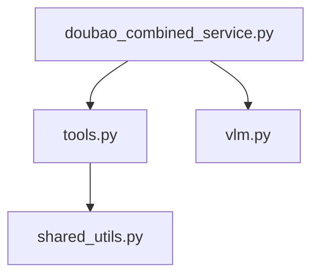

# Flask OpenAI 后端文档

## 文件结构说明

### 1. doubao_combined_service.py
主服务入口，集成豆包AI和图书搜索功能。

核心功能：
```python
@app.route('/api/doubao/chat', methods=['POST'])
def doubao_chat():
    """处理豆包AI聊天请求"""
    data = request.get_json()
    messages = data.get('messages', [])
    # 调用工具处理...
    return jsonify(response)
```

### 2. download_zlib_book_2.py
Z-Library图书下载实现。

核心方法：
```python
def download_book(book_url):
    """使用Selenium自动化下载图书"""
    driver = webdriver.Chrome(options=chrome_options)
    try:
        driver.get(book_url)
        # 下载逻辑...
    finally:
        driver.quit()
```

### 3. tools.py
工具函数集合，包含：
- Google CSE搜索
- Z-Library搜索
- 下载链接获取
- 图片分析

示例工具：
```python
def process_google_cse(query: str):
    """Google自定义搜索API封装"""
    response = requests.get(API_URL, params={"q": query})
    return process_results(response.json())
```

### 4. vlm.py
视觉语言模型处理模块。

核心功能：
```python
def analyze_image(image_data: str):
    """分析图片内容"""
    # 调用视觉模型API...
    return analysis_result
```

### 5. search_client.py
该模块已废弃，搜索功能已集成到tools.py中。

### 6. shared_utils.py
共享工具函数。

常用工具：
```python
def encrypt_data(data: str):
    """AES加密工具"""
    cipher = AES.new(key, AES.MODE_CBC, iv)
    return cipher.encrypt(pad(data.encode()))
```

### 7. aes_test.py
加密算法测试验证。

测试用例：
```python
def test_encryption():
    """验证加密解密流程"""
    encrypted = encrypt_data("test")
    assert decrypt_data(encrypted) == "test"
```

## 模块依赖关系

