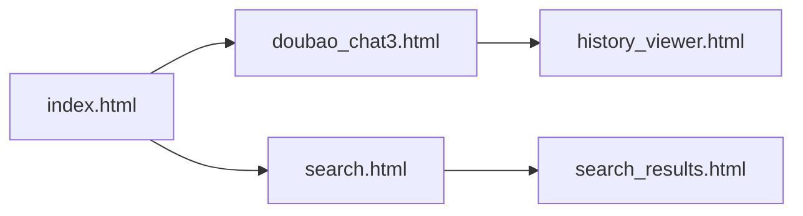

# 前端模板文档

## 文件分类

### 1. 核心功能页面
- `doubao_chat3.html`：主聊天界面
- `search.html`：图书搜索页面  
- `search_results.html`：搜索结果展示

### 2. 管理界面
- `login.html`：管理员登录
- `history_viewer.html`：历史记录查看
- `history_report.html`：数据报表

### 3. 工具页面
- `vlm_upload.html`：图片上传分析
- `SQL.html`：数据库查询工具
- `javasql.html`：Java SQL接口

## 核心页面说明

### doubao_chat3.html
主聊天界面，功能包括：
```html
<div class="chat-container">
    <!-- 消息历史区 -->
    <div id="chatHistory"></div>
    
    <!-- 输入区 -->
    <textarea id="userInput"></textarea>
    <input type="file" id="imageUpload">
</div>
```
特点：
- 支持文本/图片混合输入
- 实时消息展示
- 响应式布局

### search.html
图书搜索表单：
```html
<form action="/search" method="post">
    <input type="text" name="query" required>
    <button type="submit">搜索</button>
</form>
```

### login.html
管理员登录：
```javascript
document.getElementById('loginForm').addEventListener('submit', async (e) => {
    const response = await fetch('/admin/login', {
        method: 'POST',
        body: new FormData(e.target)
    });
    // 处理登录结果
});
```

## 页面关系图

