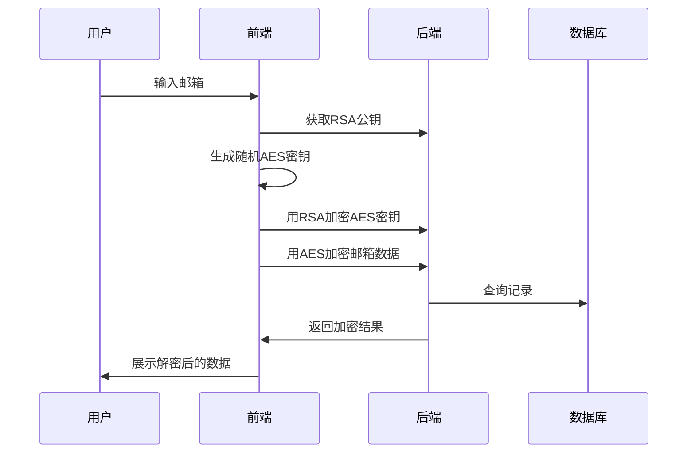

# download_history_form_copy.html 说明文档

## 文件功能
下载历史记录查询页面，提供以下功能：
- 邮箱验证表单
- 加密数据传输（AES+RSA混合加密）
- 查询结果动态渲染
- 错误处理和加载状态

## 加密流程


## 核心代码

### 加密处理
```javascript
// 生成随机AES密钥
function generateRandomAESKey() {
    const array = new Uint8Array(32);
    window.crypto.getRandomValues(array);
    return Array.from(array, byte => byte.toString(16).padStart(2, '0')).join('');
}

// 加密传输流程
fetch('/api/rsa/key')
    .then(response => response.json())
    .then(rsaData => {
        const aesKey = generateRandomAESKey();
        return fetch('/api/rsa/encrypt-key', {
            method: 'POST',
            body: JSON.stringify({ aes_key: aesKey })
        })
    })
```

### 结果展示
```html
<table class="table table-striped">
    <thead>
        <tr>
            <th>文件名</th>
            <th>下载时间</th>
        </tr>
    </thead>
    <tbody id="resultsTable">
        <!-- 动态加载结果 -->
    </tbody>
</table>
```

## 相关接口
- `GET /api/rsa/key` 获取RSA公钥
- `POST /api/rsa/encrypt-key` 加密AES密钥
- `POST /download_history` 提交查询请求
