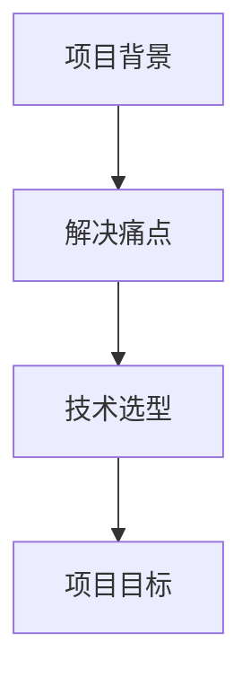
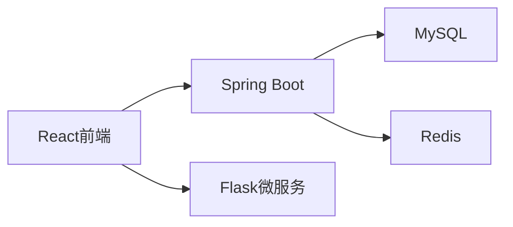
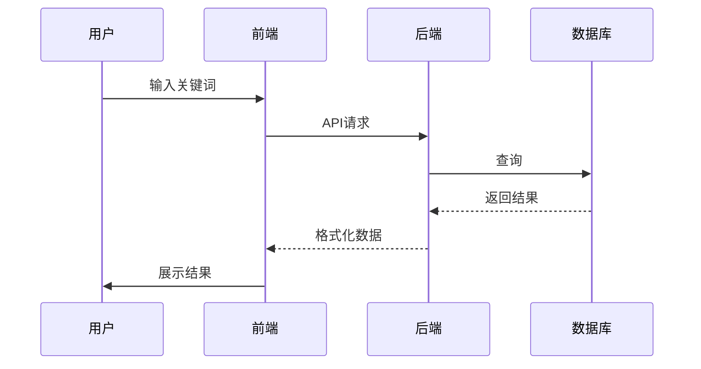

# 答辩PPT详细内容规划

## 1. 项目概述

## 2. 系统架构
### 2.1 技术架构图

### 2.2 模块划分
- 搜索模块
- 聊天模块
- 下载模块
- 历史记录模块

## 3. 核心功能实现
### 3.1 搜索功能流程

## 4. 技术亮点
1. 多语言协同架构
2. 响应式前端设计
3. 缓存优化策略

## 5. 演示准备
- 主要界面截图
- 关键操作录屏
- 性能测试数据

## 6. 问答准备补充
新增可能问题：
Q6: 为什么使用多种后端技术？
A6: Java适合核心业务，Python适合快速原型开发，各取所长

Q7: 如何评估项目成功？
A7: 通过用户反馈、系统响应时间和错误率等指标
