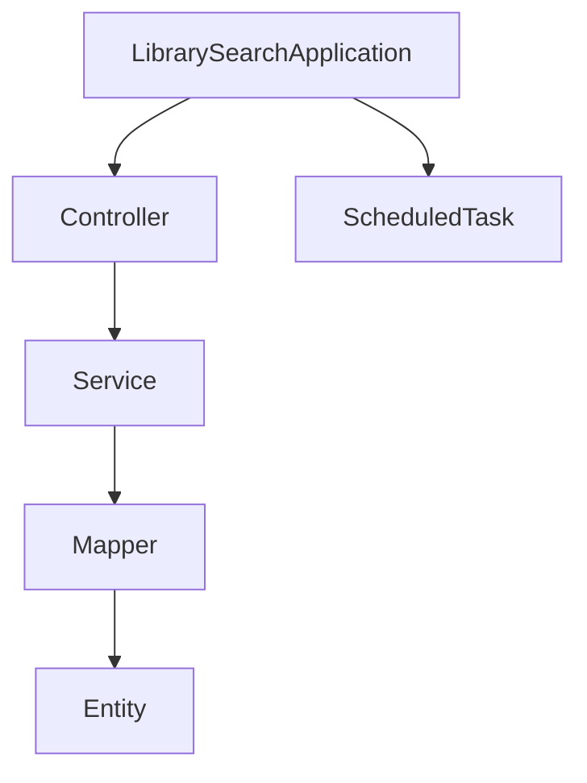

# Java 后端代码文档

## 项目结构

### 1. Controller层
处理HTTP请求的入口类：

#### BookController.java
- 功能：图书相关操作接口
- 核心方法：
```java
@GetMapping("/books")
public List<Book> listBooks() {
    return bookService.getAllBooks();
}
```

#### ChatController.java
- 功能：聊天对话接口
- 核心注解：
```java
@RestController
@RequestMapping("/api/chat")
```

#### SearchController.java
- 功能：图书搜索接口
- 核心逻辑：
```java
@PostMapping("/search")
public SearchResult search(@RequestBody SearchRequest request) {
    return searchService.search(request.getQuery());
}
```

### 2. Entity层
数据库实体类：

#### SearchHistoryDaily.java
- 功能：每日搜索历史记录实体
- 核心字段：
```java
@Id
@GeneratedValue
private Long id;

@Column(name = "search_date")
private LocalDate searchDate;
```

### 3. Entry类
数据条目类：

#### SearchHistoryEntry.java
- 功能：搜索历史条目
- 包含字段：query, timestamp, userId

### 4. Mapper层
数据访问接口：

#### SearchHistoryMapper.java
- 功能：搜索历史数据库操作
- 核心方法：
```java
@Select("SELECT * FROM search_history WHERE user_id = #{userId}")
List<SearchHistory> findByUserId(Long userId);
```

### 5. Service层
业务逻辑实现：

#### SearchServiceImpl.java
- 功能：搜索业务实现
- 核心方法：
```java
@Override
public SearchResult search(String query) {
    // 实现搜索逻辑
}
```

#### GetDLinkImpl.java
- 功能：下载链接获取实现
- 使用技术：Selenium WebDriver

### 6. Task类
定时任务：

#### ScheduledUploadTask.java
- 功能：定时上传任务
- 定时设置：
```java
@Scheduled(cron = "0 0 3 * * ?")
```

### 7. 主类

#### LibrarySearchApplication.java
- 功能：Spring Boot启动类
- 核心注解：
```java
@SpringBootApplication
@EnableScheduling
```

## 类关系图

