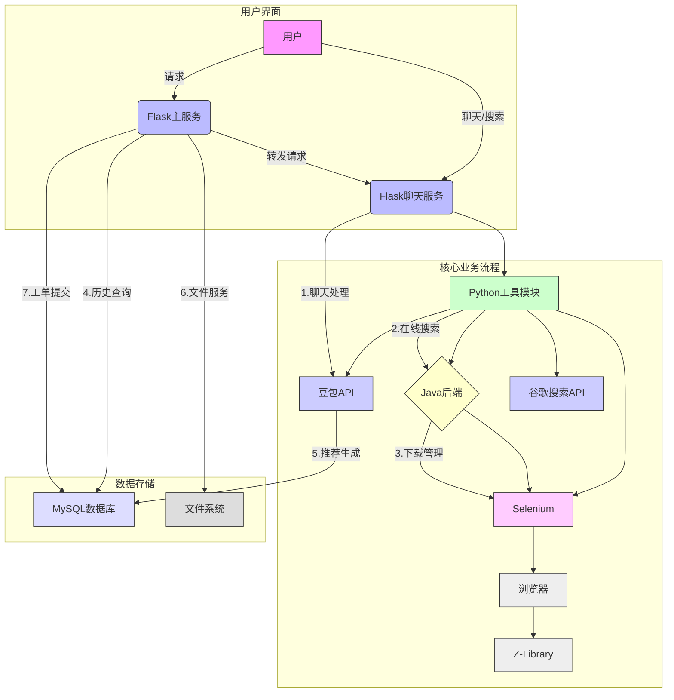

### 详细流程说明

1. **聊天处理流程**
   - 用户输入文本/图片
   - 调用豆包API分析
   - 判断是否需要工具
   - 执行相应工具或直接回复

2. **在线搜索流程**  
   - 检查缓存
   - 使用Selenium爬取Z-Library
   - 解析结果并保存元数据

3. **下载管理流程**
   - 检查本地文件
   - 使用Selenium获取下载链接
   - 监控下载进度
   - 记录下载历史

4. **历史查询流程**
   - 解密用户凭证
   - 查询MySQL数据库
   - 返回下载记录

5. **推荐生成流程**
   - 分析用户下载历史
   - 调用豆包API生成推荐
   - 保存推荐结果

6. **文件服务流程**
   - 扫描本地目录
   - 提供文件下载
   - 删除重复文件

7. **工单提交流程**
   - 接收用户请求
   - 计算书籍哈希
   - 存储到数据库
