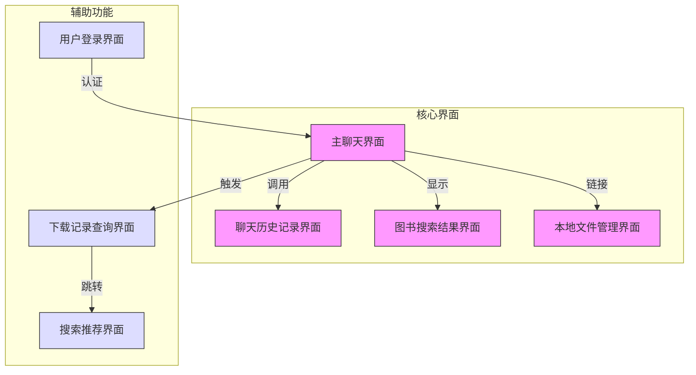

### 客户端功能模块说明

1. **主聊天界面**
   - 用户与AI交互的核心界面
   - 支持发送文本/图片消息
   - 显示AI响应及工具输出(如搜索结果)
   - 可跳转到其他功能界面

2. **聊天历史记录界面**
   - 列表展示历史会话(ID+标题)
   - 支持加载历史继续对话
   - 与主界面无缝切换

3. **图书搜索结果界面**
   - 展示Z-Library等来源的搜索结果
   - 显示书名/URL/元数据
   - 包含独立本地图书搜索功能

4. **本地文件管理界面**
   - 列出服务器存储的下载文件
   - 支持按文件名搜索
   - 文件操作入口

5. **下载记录查询界面**  
   - 输入加密邮箱查询下载历史
   - 表格形式展示查询结果
   - 关联推荐系统

6. **搜索推荐界面**
   - 展示基于下载历史的搜索词推荐
   - 智能关键词建议
   - 可快速发起新搜索

7. **用户登录界面**
   - 收集用户认证信息
   - 建立会话凭证
   - 门户跳转到主界面
