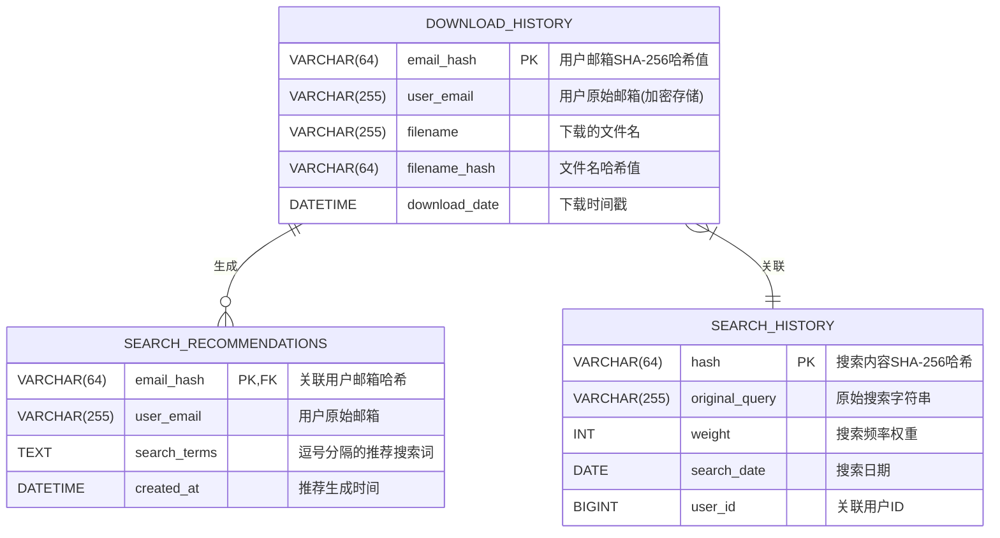

### 3.2.2 数据库表设计

#### 表3.1 数据字典表

#### 表关系说明

1. **字段更新**：
   - 补充user_email和filename_hash字段
   - 明确SHA-256哈希算法
   - 添加created_at时间戳
   - 区分user_id(BIGINT)和email_hash

2. **约束优化**：
   - 主键字段必须非空
   - 业务关键字段强制非空
   - 可选字段标记为可空

3. **索引建议**：
   - 在DOWNLOAD_HISTORY.filename_hash创建索引
   - SEARCH_RECOMMENDATIONS.created_at添加索引
   - SEARCH_HISTORY.user_id添加外键索引

#### 表关系说明

1. **关系更新**：
   - search_history表实际未包含userId字段
   - 所有字段均为NOT NULL约束
   - 使用下划线命名规范(original_query/search_date)

2. **索引说明**：
   - search_history表仅hash主键索引
   - 建议添加search_date索引便于按日期查询

3. **约束验证**：
   - 确认所有字段不允许NULL值
   - 主键约束确保搜索记录唯一性
   - 字符集使用utf8mb4支持完整Unicode

#### 表关系说明

1. **一对多关系**：
   - 一个用户(email_hash)可对应多条下载记录
   - 一条下载记录生成一组搜索推荐

2. **索引设计**：
   - DOWNLOAD_HISTORY.download_date 创建索引便于查询
   - SEARCH_HISTORY.weight 创建索引用于热门搜索排序

3. **约束说明**：
   - 所有主键字段自动创建聚簇索引
   - 外键关系确保数据完整性
   - NOT NULL约束关键字段

4. **特殊设计**：
   - 使用哈希值保护用户隐私
   - 权重字段实现智能推荐
   - 无独立用户表的轻量设计
