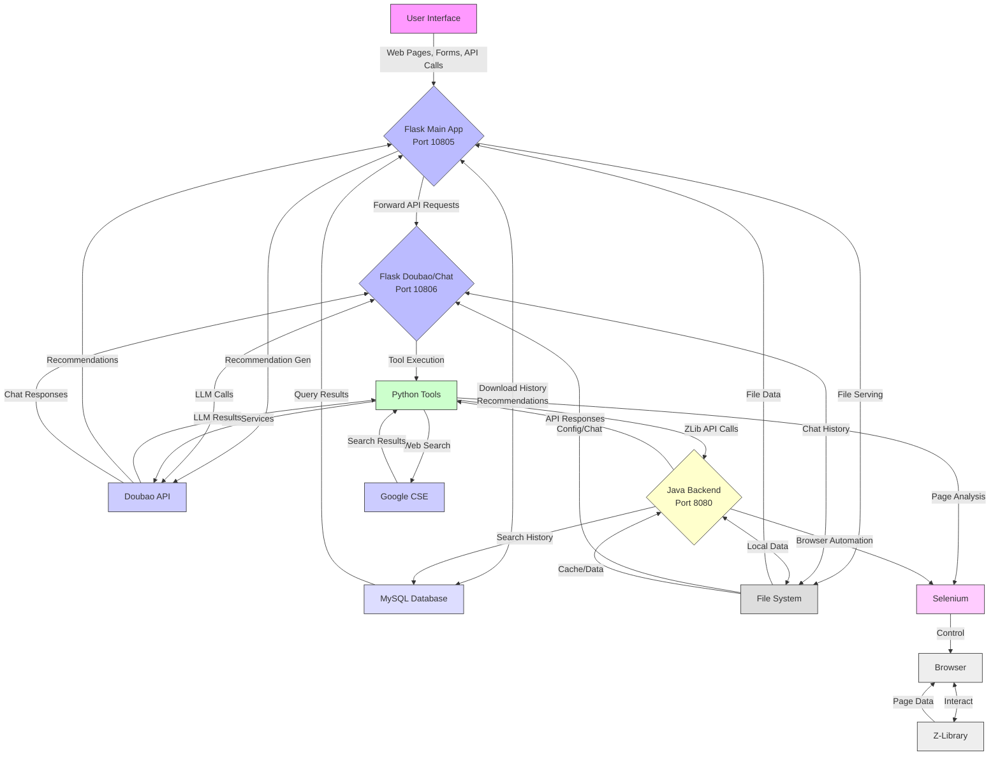

```mermaid
graph TD
    %% 系统组件定义
    A[User Interface] --> |Web Pages, Forms, API Calls| B{Flask Main App\nPort 10805};
    B --> |Forward API Requests| C{Flask Doubao/Chat\nPort 10806};
    B <--> |Download History\nRecommendations| G[MySQL Database];
    B --> |File Serving| H[File System];
    B --> |Recommendation Gen| I[Doubao API];

    C --> |Tool Execution| D[Python Tools];
    C <--> |Chat History| H;
    C <--> |LLM Calls| I;

    D --> |ZLib API Calls| E{Java Backend\nPort 8080};
    D --> |LLM Services| I;
    D --> |Web Search| J[Google CSE];
    D --> |Page Analysis| K[Selenium];

    E --> |Browser Automation| K;
    E --> |Search History| G;
    E <--> |Local Data| H;

    K --> |Control| L[Browser];
    L <--> |Interact| M[Z-Library];

    %% 数据流向
    G --> |Query Results| B;
    H --> |File Data| B;
    H --> |Config/Chat| C;
    H --> |Cache/Data| E;
    E --> |API Responses| D;
    I --> |LLM Results| D;
    I --> |Recommendations| B;
    I --> |Chat Responses| C;
    J --> |Search Results| D;
    M --> |Page Data| L;

    %% 样式定义
    style A fill:#f9f,stroke:#333
    style B fill:#bbf,stroke:#333
    style C fill:#bbf,stroke:#333
    style D fill:#cfc,stroke:#333
    style E fill:#ffc,stroke:#333
    style G fill:#ddf,stroke:#333
    style H fill:#ddd,stroke:#333
    style I fill:#ccf,stroke:#333
    style J fill:#ccf,stroke:#333
    style K fill:#fcf,stroke:#333
    style L fill:#eee,stroke:#333
    style M fill:#eee,stroke:#333
```
