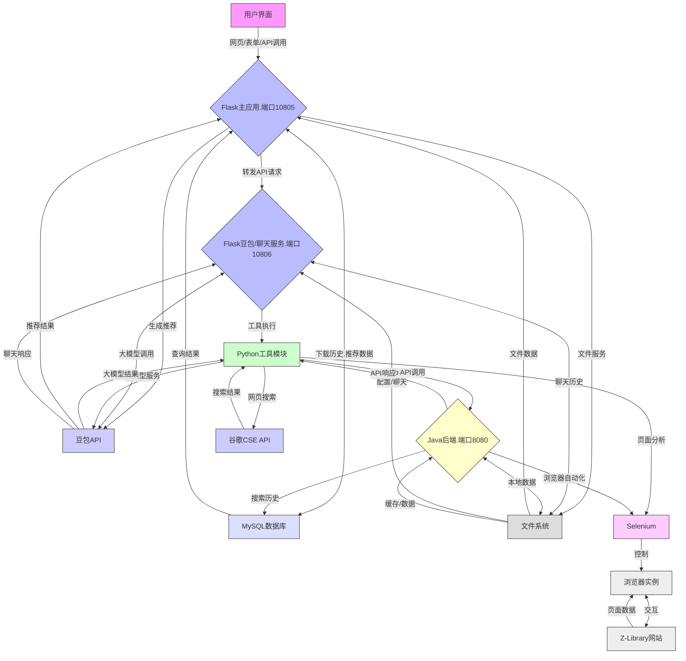

数据流图文字描述如下：
1. 用户界面组件接收用户输入，通过网页/表单/API调用与Flask主应用(端口10805)交互；
2. Flask主应用转发API请求至Flask豆包/聊天服务(端口10806)，同时与MySQL数据库交换下载历史和推荐数据；
3. 聊天服务调用Python工具模块执行具体功能，包括ZLib API调用、大模型服务和网页搜索；
4. Java后端(端口8080)通过Selenium实现浏览器自动化，与Z-Library网站交互；
5. 系统各组件与文件系统交互，存储和读取聊天历史、缓存数据等；
6. 豆包API提供大模型服务，处理聊天响应和推荐结果；
7. 所有数据交互通过定义良好的API接口完成，关键操作记录日志。
