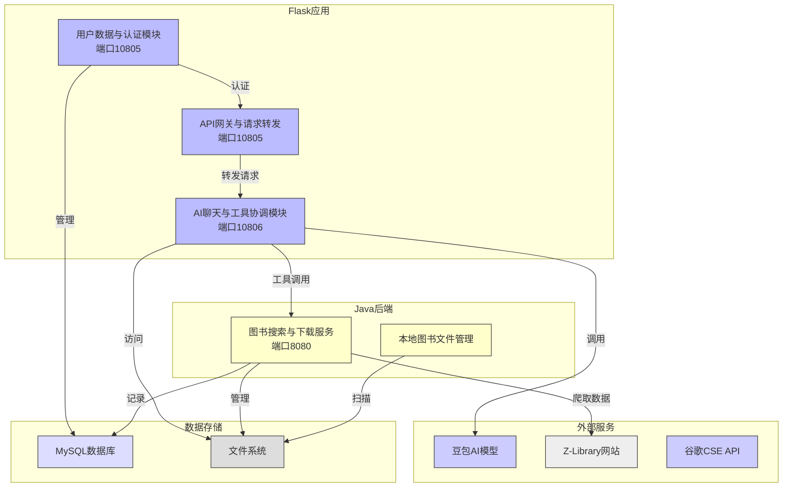

### 服务器端功能模块说明

1. **AI聊天与工具协调模块(Flask 10806)**
   - 处理用户聊天消息的主要接口
   - 调用豆包AI模型进行对话补全和嵌入
   - 自动判断是否使用工具(网页搜索/ZLib搜索/下载链接获取等)
   - 管理聊天历史(存储为JSON文件)
   - 处理图片分析请求(VLM服务)

2. **图书搜索与下载服务(Java 8080)**
   - 提供图书搜索(/search)和下载链接获取(/getdlink)接口
   - 使用Selenium自动化操作Z-Library网站
   - 处理下载限制和刷新逻辑
   - 记录搜索历史(文件和数据库)
   - 缓存搜索结果加速重复请求

3. **本地图书文件管理(Java)**
   - 扫描管理已下载图书的元数据(JSON文件)
   - 提供本地图书列表(/booklist)和搜索(/search/books)接口
   - 实现基于关键词匹配的评分机制

4. **用户数据与认证模块(Flask 10805)**
   - 用户登录和会话管理
   - 使用@login_required保护路由
   - 管理用户下载历史(MySQL)
   - 基于下载历史生成搜索推荐(调用AI模型)
   - 实现数据加密(AES/RSA)

5. **API网关与请求转发(Flask 10805)**
   - 将请求转发至核心服务(端口10806)
   - 处理静态页面服务(历史查询/文件列表等)
   - 保持原始请求路径和参数

6. **数据存储**
   - MySQL: 存储用户数据/下载历史/推荐记录
   - 文件系统: 存储聊天历史/图书元数据/下载文件
