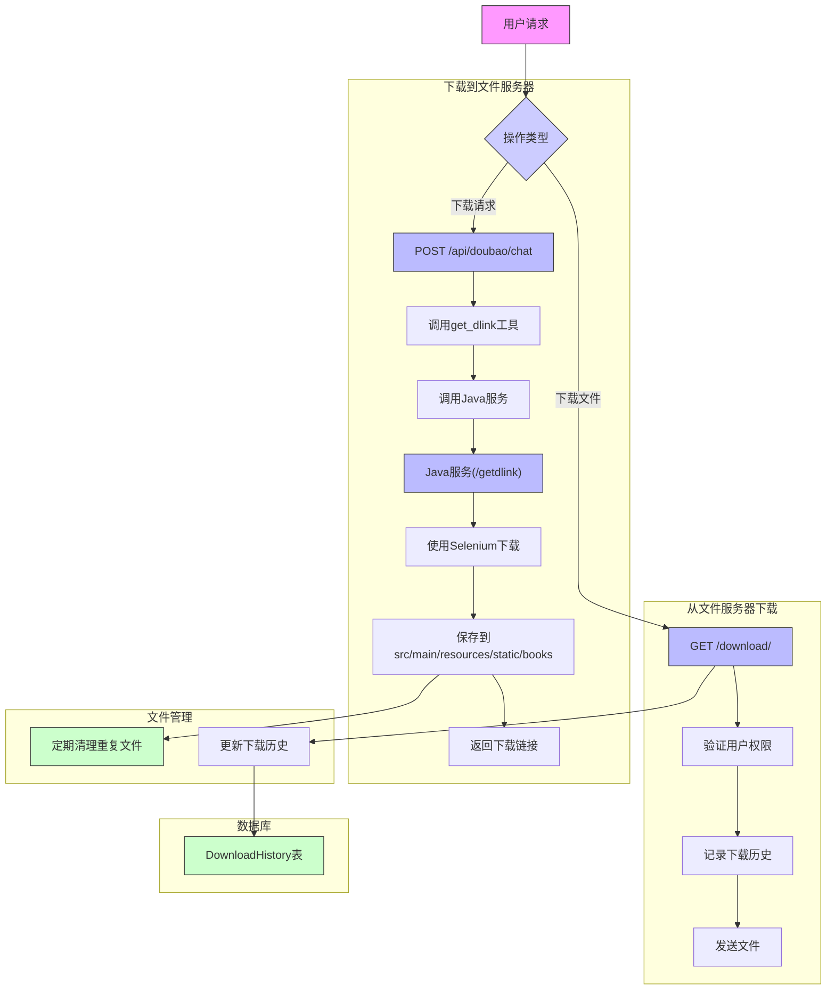

### 4.2.6 下载图书到文件服务器和从文件服务器下载图书功能实现

#### 模块说明

1. **下载到文件服务器**：
   - 由豆包大模型触发get_dlink工具调用
   - Python服务转发请求到Java服务
   - Java服务使用Selenium自动化下载流程
   - 文件保存到统一目录(src/main/resources/static/books)

2. **从文件服务器下载**：
   - 通过/download/<filename>端点提供文件
   - 需要用户登录验证
   - 记录下载历史到数据库
   - 使用Flask的send_file发送文件

3. **文件管理**：
   - 定期检查并删除重复文件
   - 维护下载历史记录
   - 提供文件列表查询接口

4. **数据库**：
   - DownloadHistory表记录下载历史
   - 包含用户邮箱、文件名、下载时间等信息
