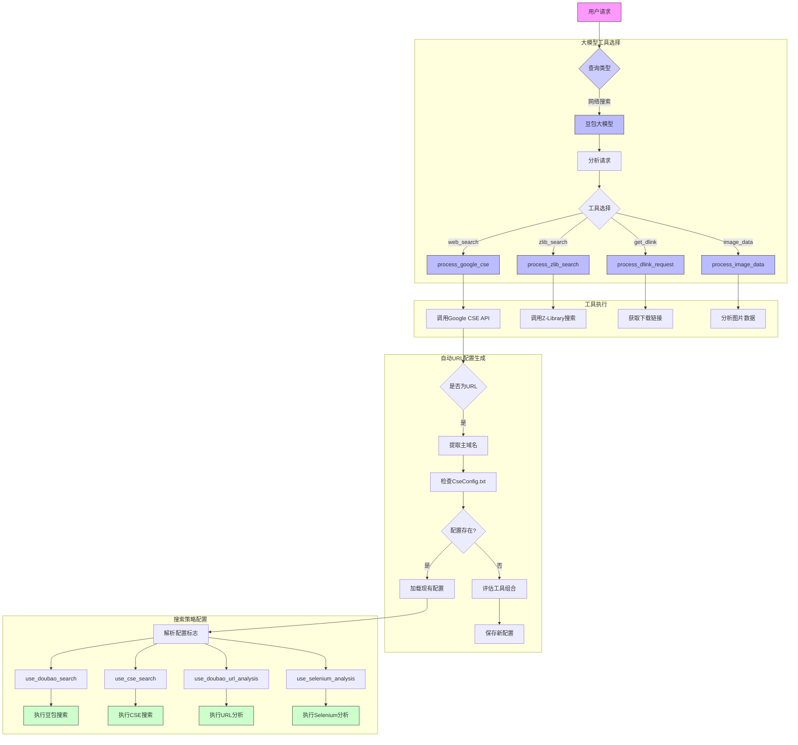

### 4.2.4 大模型工具选择与执行

#### 模块说明

1. **大模型工具选择**：
   - 使用豆包大模型(doubao-1-5-lite-32k-250115)分析用户请求
   - 自动选择最合适的工具(web_search/zlib_search/get_dlink/image_data)
   - 工具选择结果传递给对应的处理函数

2. **工具执行**：
   - process_google_cse: 处理Google CSE搜索
   - process_zlib_search: 处理Z-Library搜索
   - process_dlink_request: 处理下载链接获取
   - process_image_data: 处理图片分析

3. **自动URL配置生成**：
   - 检测输入是否为URL
   - 提取主域名并检查CseConfig.txt
   - 对新域名评估最佳工具组合(使用doubao模型评估)
   - 保存评估结果到CseConfig.txt

4. **搜索策略配置**：
   - 从CseConfig.txt加载配置
   - 解析配置标志(4位二进制标志)
   - 根据标志动态启用/禁用不同搜索方法
   - 执行配置指定的搜索和分析方法