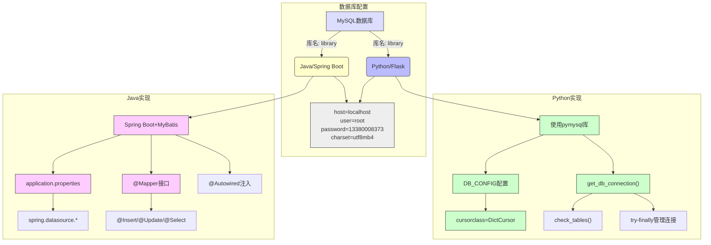

### 4 系统功能实现
#### 4.1 系统主要模块设计
##### 4.1.2 数据库连接模块

#### 模块说明

1. **共享配置**：
   - 数据库：library
   - 主机：localhost
   - 用户：root
   - 密码：13380008373
   - 字符集：utf8mb4

2. **Python/Flask实现**：
   - 使用pymysql驱动
   - DB_CONFIG配置字典包含完整连接参数
   - 采用DictCursor返回字典格式结果
   - 手动连接管理(get_db_connection)
   - 自动检查表结构(check_tables)
   - try-finally确保连接关闭

3. **Java/Spring Boot实现**：
   - 基于Spring DataSource
   - application.properties配置
   - 集成MyBatis框架
   - @Mapper接口定义SQL操作
   - 注解式SQL(@Insert/@Update等)
   - 自动依赖注入(@Autowired)

4. **技术对比**：
   | 特性 | Python实现 | Java实现 |
   |------|------------|----------|
   | 驱动 | pymysql | mysql-connector-java |
   | 连接管理 | 手动 | 自动池化 |
   | SQL执行 | 原生语句 | MyBatis映射 |
   | 事务 | 手动控制 | 声明式事务 |
   | 返回结果 | 字典格式 | 实体对象 |

5. **最佳实践**：
   - Python端确保及时释放连接
   - Java端利用MyBatis缓存
   - 统一字符集避免乱码
   - 敏感配置应加密处理
