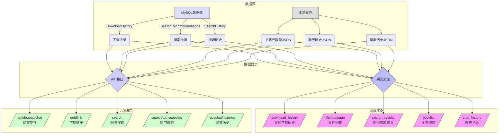

### 4 系统功能实现
#### 4.1 系统主要模块设计
##### 4.1.1 数据显示模块

#### 模块说明

1. **数据源**：
   - MySQL数据库：存储下载记录、搜索推荐和搜索历史
   - 本地文件：包含书籍元数据、聊天历史和搜索历史JSON文件

2. **数据显示方式**：
   - **网页渲染**：
     - 文件下载历史页面
     - 文件列表主页面(带分页)
     - 图书搜索结果页面
     - 全部书籍列表
     - 聊天记录查看页面
   - **API接口**：
     - 聊天交互接口
     - 下载链接获取
     - 图书搜索接口
     - 热门搜索词接口
     - 聊天历史数据接口

3. **技术实现**：
   - Flask渲染HTML模板
   - Spring Boot管理部分页面
   - 统一JSON数据格式
   - 分页功能支持
