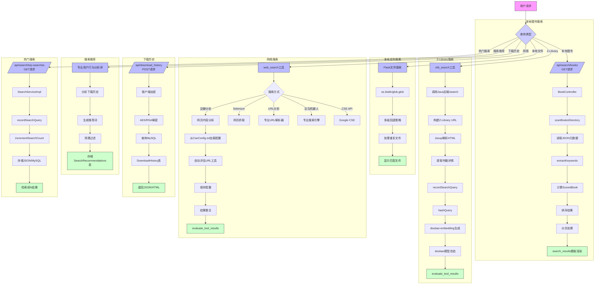
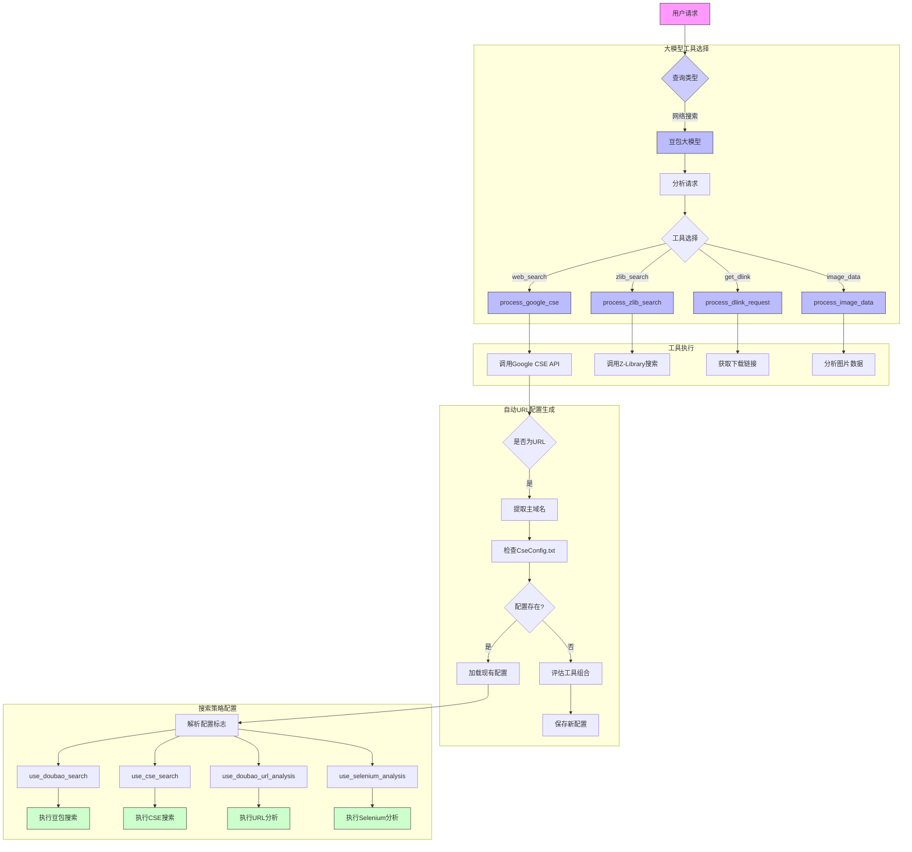

### 4.2.3 查询功能实现

### 4.2.4 大模型工具选择与执行

#### 模块说明

1. **大模型工具选择**：
   - 使用豆包大模型(doubao-1-5-lite-32k-250115)分析用户请求
   - 自动选择最合适的工具(web_search/zlib_search/get_dlink/image_data)
   - 工具选择结果传递给对应的处理函数

2. **工具执行**：
   - process_google_cse: 处理Google CSE搜索
   - process_zlib_search: 处理Z-Library搜索
   - process_dlink_request: 处理下载链接获取
   - process_image_data: 处理图片分析

3. **自动URL配置生成**：
   - 检测输入是否为URL
   - 提取主域名并检查CseConfig.txt
   - 对新域名评估最佳工具组合(使用doubao模型评估)
   - 保存评估结果到CseConfig.txt

4. **搜索策略配置**：
   - 从CseConfig.txt加载配置
   - 解析配置标志(4位二进制标志)
   - 根据标志动态启用/禁用不同搜索方法
   - 执行配置指定的搜索和分析方法

#### 模块说明

1. **本地图书搜索**：
   - 通过Java后端BookController处理
   - 基于JSON元数据的关键词提取和评分
   - 支持分页和模板渲染

2. **Z-Library搜索**：
   - Python和Java后端协作
   - 结合网页解析和AI模型处理
   - 记录搜索历史并生成嵌入

3. **本地文件搜索**：
   - Flask实现的多级文件搜索
   - 智能回退策略处理不同匹配程度
   - 重复文件处理机制

4. **网络搜索**：
   - 多种搜索方式灵活切换
   - 配置驱动的工作流程
   - 结果整合和格式化输出

5. **下载历史查询**：
   - 加密邮箱的安全查询
   - MySQL数据库交互
   - 多种结果展示格式

6. **搜索推荐**：
   - AI驱动的行为分析
   - 推荐词生成和过滤
   - 数据库存储机制

7. **热门搜索**：
   - 搜索频率统计
   - 双存储机制(JSON+MySQL)
   - 实时排名展示