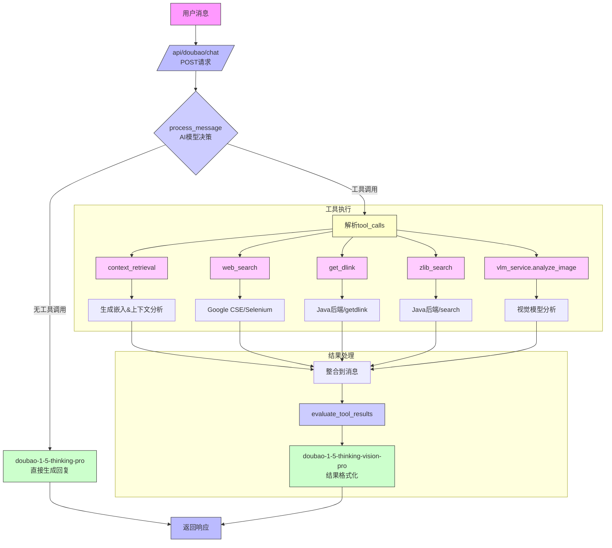

### 4.2 其他功能模块设计
#### 4.2.2 聊天工具调用功能实现



#### 模块说明

1. **核心流程**：
   - 用户消息通过POST请求进入系统
   - AI模型(doubao-1-5-lite)自动判断是否调用工具
   - 根据决策选择直接回复或执行工具调用

2. **工具类型**：
   - 上下文检索：context_retrieval
   - 网页搜索：web_search(Google CSE/Selenium)
   - 下载链接获取：get_dlink(调用Java后端)
   - 图书搜索：zlib_search(调用Java后端)
   - 图像分析：vlm_service

3. **关键技术**：
   ```mermaid
   flowchart LR
       X[AI决策] --> Y{工具类型}
       Y -->|搜索类| Z[外部API调用]
       Y -->|下载类| W[Java后端交互]
       Y -->|分析类| V[AI模型处理]
   ```

4. **结果处理**：
   - 原始工具结果通过evaluate_tool_results格式化
   - 使用vision-pro模型生成自然语言响应
   - 保持结果准确性和可读性

5. **性能优化**：
   - AI模型轻量级决策(doubao-lite)
   - 工具调用并行处理
   - 结果缓存机制
   - 错误重试策略
