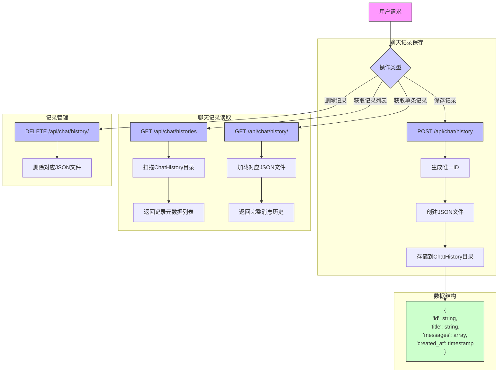

### 4.2.5 聊天记录保存与读取功能实现

#### 模块说明

1. **聊天记录保存**：
   - 接收包含消息列表的POST请求
   - 自动生成唯一ID(基于时间戳)
   - 将完整对话历史保存为JSON文件
   - 支持包含图片消息的存储

2. **聊天记录读取**：
   - 提供获取记录列表的端点，返回精简元数据
   - 提供获取单条完整记录的端点
   - 支持从文件系统加载历史消息

3. **记录管理**：
   - 提供删除特定记录的端点
   - 实际删除文件系统中的JSON文件

4. **数据结构**：
   - 每条记录包含完整对话消息列表
   - 记录元数据包含标题和创建时间
   - 支持特殊消息类型(如图片消息)
