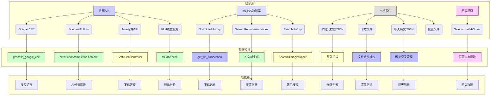

### 4.2 其他功能模块设计
#### 4.2.1 获取信息功能实现



#### 模块说明

1. **信息源分类**：
   - 外部API：Google CSE、Doubao AI、VLM服务
   - 数据库：MySQL存储核心业务数据
   - 本地文件：JSON配置和历史数据
   - 网页抓取：Selenium实时获取

2. **关键技术组件**：
   - Python处理层：pymysql、requests
   - Java处理层：MyBatis Mapper
   - AI集成：Doubao多模型调用
   - 文件操作：目录扫描和JSON解析

3. **数据流特点**：
   ```mermaid
   flowchart LR
       A[外部请求] --> B{路由判断}
       B -->|搜索| C[Google CSE]
       B -->|下载| D[Java API]
       B -->|聊天| E[Doubao AI]
       C --> F[结果处理]
       D --> F
       E --> F
       F --> G[响应输出]
   ```

4. **性能考虑**：
   - 高频操作使用数据库存储
   - 大文件采用本地缓存
   - AI服务调用做限流控制
   - 网页抓取设置超时机制

5. **错误处理**：
   - API调用异常重试机制
   - 数据库连接失败自动恢复
   - 文件操作完整性校验
   - 网络请求超时处理
